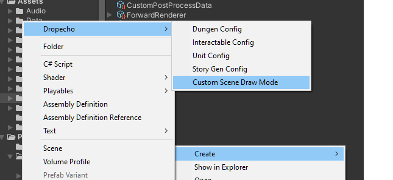
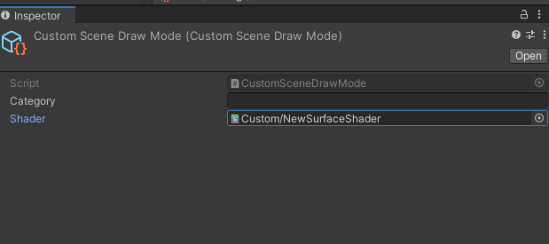
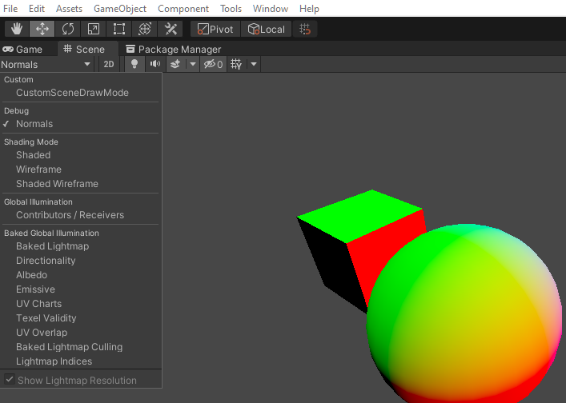

## How to Install

You can click on the code button in the top right, copy that or just copy this 
```git@github.com:dropecho/unity_custom_scene_modes.git```

Open unity, and open the package manager, in the dropdown select install from git, and paste that in.


It should then show up in the list of installed packages


## USAGE

Use the context menu to create a \"Dropecho/Custom Scene Draw Mode\" Asset.
Assign a shader to the new asset and it should be available in the scene view modes dropdown.

A simple example showing the normal directions as a colored texture is included.






